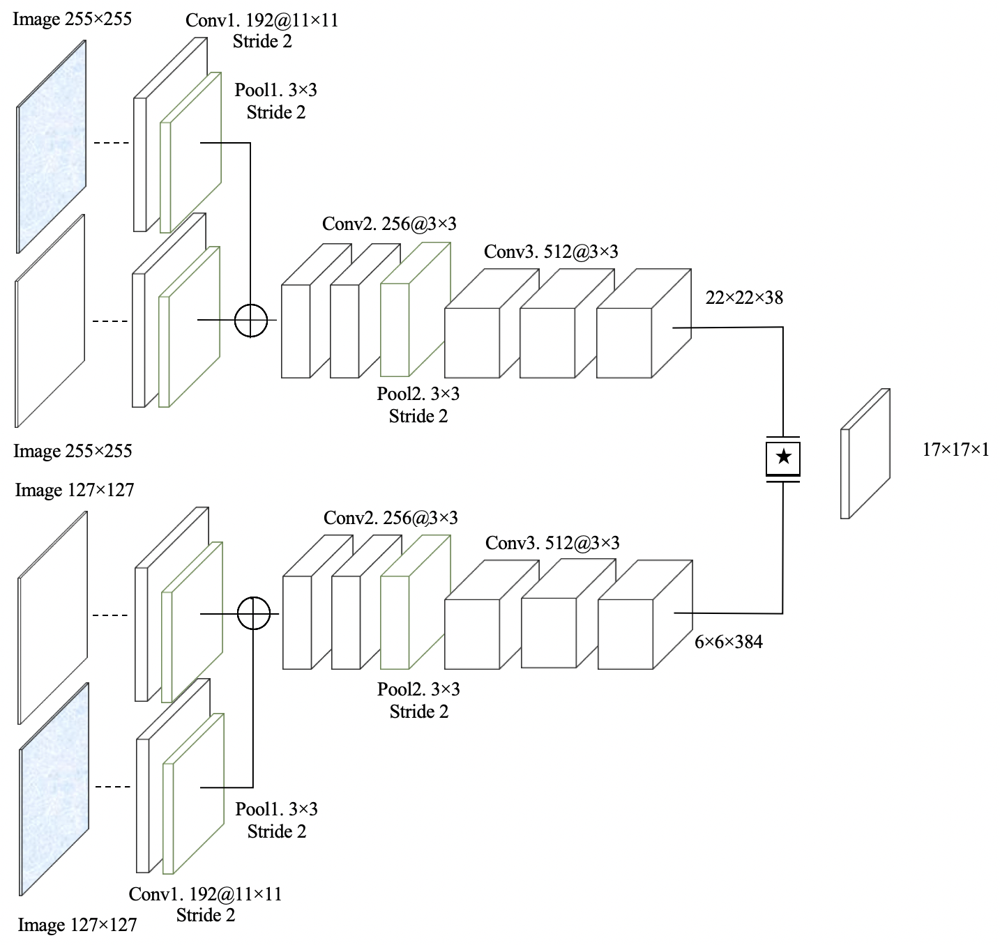
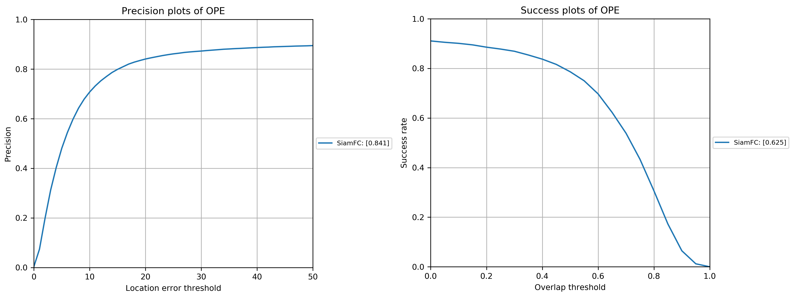
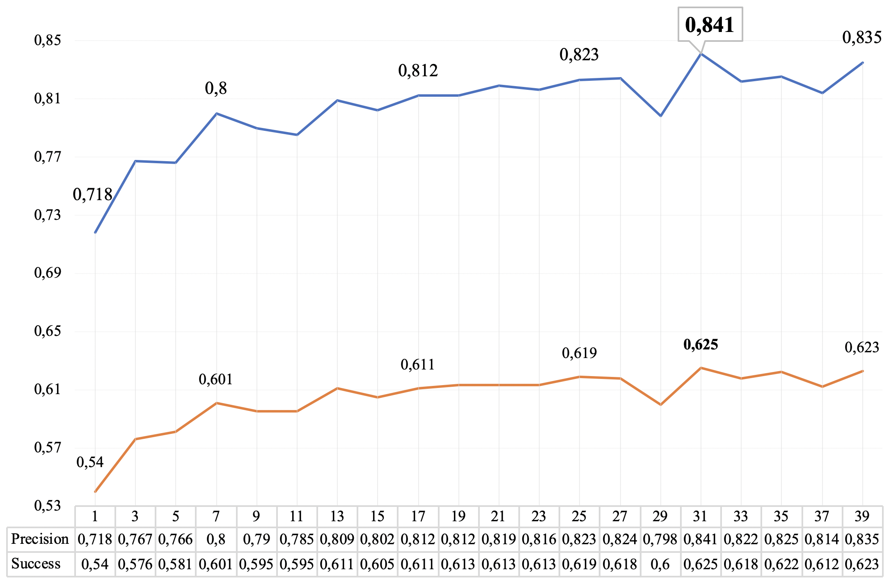

# SiamFusion PyTorch implementation
## Introduction
This is my Thesis in the direction of Visual Object Tracking.

**SiamFusion architecture**
<center>
    <figure>
        
        <figcaption>
        </figcaption>
    </figure>
</center>

## How to Run - Training
1. **Prerequisites:** The project was built using **python 3.6** and tested on Ubuntu 18.04 and 16.04. It was tested on a **GTX 1080 Ti**. Furthermore it requires [PyTorch 4.1](https://pytorch.org/).

2. Download the **GOT-10k** Dataset in http://got-10k.aitestunion.com/downloads and extract it on the folder of your choice, in my case it is `/home/arbi/desktop/GOT-10k` (OBS: data reading is done in execution time, so if available extract the dataset in your SSD partition).
<center>
    <figure>
        
        <figcaption>
        </figcaption>
    </figure>
</center>

3. Download the ImageNet VID Dataset in http://bvisionweb1.cs.unc.edu/ILSVRC2017/download-videos-1p39.php and extract it on the folder of your choice (OBS: data reading is done in execution time, so if available extract the dataset in your SSD partition). You can get rid of the test part of the dataset, since it has no Annotations.

4. In **config.py** script `root_dir_for_GOT_10k`, `root_dir_for_VID and` and `root_dir_for_OTB` change to your directory. 
```
root_dir_for_GOT_10k = '/home/arbi/desktop/GOT-10k' <-- change to your directory 
root_dir_for_VID     = '/home/arbi/desktop/VID'     <-- change to your directory
root_dir_for_OTB     = '/home/arbi/desktop/OTB2015' <-- change to your directory 
```

5. Run the **train.py** script:
```
python3 train.py
```

## How to Run - Testing
1. Download pretrained `model_e31.pth` from [Yandex Disk](https://yadi.sk/d/c-ffSCvtxkdiLw), and put the file under `model/model_e31.pth`.
<center>
    <figure>
        
        <figcaption>
        </figcaption>
    </figure>
</center>

2. Run the **test.py** script:
```
python3 test.py
```

## Results - Training
**OTB2015**
<center>
    <figure>
        
        <figcaption>
        </figcaption>
    </figure>
</center>

**Results on each epoch** 
<center>
    <figure>
        
        <figcaption>
        </figcaption>
    </figure>
</center>

